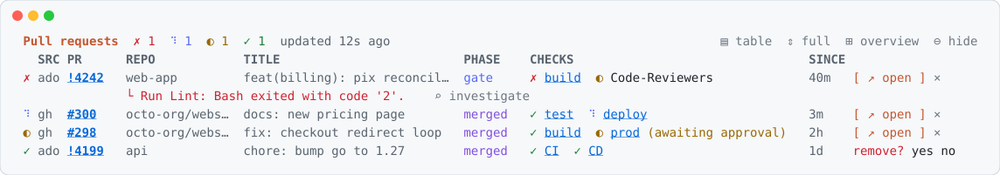

# pr-watch

A live band above the Claude Code prompt that follows your pull requests from review to deploy, for Azure DevOps and GitHub.

[Install](#install) · [What it shows](#what-it-shows) · [Usage](#usage) · [Requirements](#requirements) · [Options](#options) · [Privacy](#privacy)

<picture>
  <source media="(prefers-color-scheme: dark)" srcset="assets/band-dark.svg">
  
</picture>

## Install

```
/plugin install pr-watch --marketplace heidiks/agent-kit
```

## What it shows

- **Gate:** build validation and checks, reviewers and their votes, merge conflicts, drafts.
- **After merge:** the pipelines and checks of the merge commit, with stages and pending approvals. A run that "succeeded" while a stage approval was never granted is flagged instead of shown green.
- **Failures:** the failing task or annotation inline, plus an `investigate` button that asks Claude to read the log and propose a fix (nothing is applied).
- **Row actions:** `↗ open` opens the PR in the browser, `×` stops watching it after an inline `remove? yes no` confirmation.
- **SINCE:** how long the PR has been in its current state; a PR waiting on review or approval for over 24h is flagged (`! 2d`). The header warns when data is stale.
- **Long lists:** PRs are sorted by urgency (failing, waiting, running, ok), newest first within the same state. The band shows up to five; finished PRs collapse into one line and the rest sit behind `+N more`.
- **Modes:** `⇕` cycles the band between `full`, `compact` (one row per PR) and `mini` (one line: counts and the most urgent PR).
- **System notifications:** failures, changes requested, pending approvals, merges and finished deploys show up outside the terminal (macOS via `terminal-notifier` or `osascript`, Linux via `notify-send`). With `terminal-notifier` installed, clicking one opens the PR.
- **Overview:** `⊞ overview` opens a scrollable popup with every PR, a per-PR timeline of state changes, an `all` / `this session` filter, and an on-demand `✎ summarize` that asks Haiku for a short standup-style recap you can copy. Esc closes it.
- Four layouts (`table`, `tree`, `cards`, `trail`); follows light and dark themes.

## Usage

PRs are picked up when Claude runs `az repos pr create` or `gh pr create`, from the current branch on session start, or by hand:

```
/pr-watch 4242                                  # Azure DevOps PR id
/pr-watch https://github.com/owner/repo/pull/7  # any PR URL
/pr-watch owner/repo#7
/pr-watch mine                                  # all of your open PRs on Azure DevOps and GitHub
/pr-watch overview                              # popup with every PR, timeline and summary
/pr-watch mode [full|compact|mini]
/pr-watch rm <target> | clear | hide | show | style [table|tree|cards|trail]
```

The watched list is shared across sessions; finished PRs drop off 24h after they settle.

## Requirements

- **Azure DevOps:** [`az`](https://learn.microsoft.com/cli/azure/install-azure-cli) with the `azure-devops` extension and `az devops configure --defaults organization=... project=...`.
- **GitHub:** [`gh`](https://cli.github.com) logged in (`gh auth login`, plus `--hostname <host>` for GitHub Enterprise).

## Options

Under `/plugin` > pr-watch > configure:

| Option | Default | Effect |
|---|---|---|
| Azure DevOps | on | Watch Azure DevOps PRs |
| GitHub | on | Watch GitHub PRs |
| GitHub hosts | `github.com` | Comma-separated; add your GitHub Enterprise host |
| Failure details and stages | on | One extra call per build for the timeline or annotations |
| Current branch PR | on | Watch the open PR of the current branch on session start |
| PRs in the band | 5 | How many PRs the band shows before `+N more` |
| System notifications | `important` | `off`, `important` or `all` (every state change) |

## Privacy

pr-watch stores no tokens. Every call goes through your local `az` and `gh` sessions, and the list of watched PRs is kept on your machine.

> Built on Claude Code's early access plugin hooks API, which may change between releases.
