# pr-watch

A live band above the Claude Code prompt that follows your pull requests from review to deploy, for Azure DevOps and GitHub.

[Install](#install) · [What it shows](#what-it-shows) · [Commands](#commands) · [Spec tasks](#spec-tasks) · [Requirements](#requirements) · [Options](#options) · [Privacy](#privacy)

<picture>
  <source media="(prefers-color-scheme: dark) and (prefers-reduced-motion: reduce)" srcset="assets/band-dark.svg">
  <source media="(prefers-reduced-motion: reduce)" srcset="assets/band-light.svg">
  <source media="(prefers-color-scheme: dark)" srcset="assets/band-animated-dark.svg">
  
</picture>

## Install

```
/plugin marketplace add heidiks/agent-kit
/plugin install pr-watch@agent-kit
```

Restart the session (`claude --continue` keeps it) to load the band.

It talks to your PRs through the CLIs already logged in on your machine: `az` for Azure DevOps, `gh` for GitHub. Set up at least one, see [Requirements](#requirements).

## What it shows

- **Gate:** build validation and checks, reviewers and their votes, merge conflicts, drafts.
- **After merge:** the pipelines and checks of the merge commit, with stages and pending approvals. A run that "succeeded" while a stage approval was never granted is flagged instead of shown green.
- **Failures:** the failing task or annotation inline, plus an `investigate` button that asks Claude to read the log and propose a fix (nothing is applied).
- **Row actions:** `↗ open` opens the PR in the browser, `×` stops watching it after an inline `remove? yes no` confirmation. Clicking the title or the repo opens a detail line under the row (full title, full repo path, source → target branch, linked task, age); clicking again or `▾` closes it.
- **SINCE:** how long the PR has been in its current state; a PR waiting on review or approval for over 24h is flagged (`! 2d`). The header warns when data is stale.
- **Long lists:** PRs are sorted by urgency (failing, waiting, running, ok), newest first within the same state. The band shows up to five; finished PRs collapse into one line and the rest sit behind `+N more`.
- **Focus:** `◎ focus` keeps only the PRs that need you: failing builds or checks, conflicts, changes requested, deploys awaiting approval, reviews waiting over 24h and tasks ready to mark done. Green checks are hidden, the rest of the PRs fold into one line of counts, and only `◉ focus` and `⊞ overview` stay in the header. The choice is remembered.
- **Modes:** `⇕` cycles the band between `full`, `compact` (one row per PR) and `mini` (one line: counts and the most urgent PR).
- **System notifications:** failures, changes requested, pending approvals, merges and finished deploys show up outside the terminal (macOS via `terminal-notifier` or `osascript`, Linux via `notify-send`). With `terminal-notifier` installed, clicking one opens the PR.
- **Overview:** `⊞ overview` opens a scrollable popup with every PR, a per-PR timeline of state changes, a `this session` / `all` filter, and an on-demand `✎ summarize` that asks Haiku for a short standup-style recap you can copy. Esc closes it.
- Four layouts (`table`, `tree`, `cards`, `trail`); follows light and dark themes.

## Commands

| Command | What it does |
|---|---|
| `/pr-watch` | List this session's PRs with their state |
| `/pr-watch <id\|url\|owner/repo#N> ...` | Watch one or more PRs, separated by spaces or commas: an Azure DevOps id, any PR URL, or `owner/repo#N` |
| `/pr-watch mine` | Your open PRs: those of the session repo go to the band, the others to the overview's `all` filter |
| `/pr-watch rm <target> ...` | Stop watching one or more PRs |
| `/pr-watch clear` | Drop finished PRs |
| `/pr-watch clear-all` | Drop every PR of this session (kept for other sessions that watch it) |
| `/pr-watch overview` | Popup with every PR, plans, timeline and an on-demand summary (alias `all`) |
| `/pr-watch focus [on\|off]` | Show only PRs that need you; without a value, toggles |
| `/pr-watch mode [full\|compact\|mini]` | Band size; without a value, cycles |
| `/pr-watch style [table\|tree\|cards\|trail]` | Band layout; without a value, cycles |
| `/pr-watch hide` / `show` | Hide the band (a summary goes to the status line) or show it again |
| `/pr-watch help` | This list, inside the session |

Inside a session you can also just ask Claude ("how do I watch a PR?", "why is my PR missing?"): the plugin ships a `pr-watch-guide` skill with this guide (Claude reads it; it is not a slash command, so it never shadows `/pr-watch`).

### In the band

| Control | Action |
|---|---|
| Title or repo | Opens a detail line: full title, repo path, source → target branch, linked task, age; click again or `▾` to close |
| `↗ open` | Opens the PR in the browser |
| `×` | Stops watching, after an inline `remove? yes no` |
| `⌕ investigate` | Next to a failure: asks Claude to read the log and propose a fix |
| `✓ mark … done` | On a merged, green PR of a spec task `In Review`: asks Claude to close the tasks |
| `▤` / `⇕` / `⊞` / `⊖` | Layout / mode / overview / hide |

### Which PRs a session watches

Those created in it (any repository, via `az`, `gh` or the Azure DevOps REST API, whatever the output format), the open PR of the current branch, PRs of spec tasks `In Review`, and those added with `/pr-watch`. Only these show in the band, get polled and send notifications, so two sessions on different fronts never mix or notify twice. `claude --continue` keeps the session and its PRs. Each session saves its own list, so parallel sessions never overwrite each other; the list of a session idle for 14 days is dropped. The overview's `all` filter shows other sessions' PRs with their last known state, and `+ watch here` brings one into the current session. Finished PRs drop off 24h after they settle.

## Spec tasks

When the repo has [spec-driven-dev](../../skills/spec-driven-dev/README.md) task files under `docs/prd/`, pr-watch links each PR to its task through the [task and pull request contract](../../skills/spec-driven-dev/references/pull-requests.md): the `Task: <PRD>/<TASK>` lines in the PR description (one PR may cover several tasks), the `task/<PRD>/<TASK>` branch, or the PR URL in the task's `prs`.

- A PR linked to a task shows it: a `TASK` column in the table, next to the repo in the other styles (`TASK-001+2` for a PR covering three).
- PRs of tasks `In Review` are watched on session start.
- The overview gains a **PLANS** section: each active PRD with its tasks, their status and the state of their PRs, plus `+ watch PR` for task PRs not watched yet. The PRD id opens its `spec.md`, the task id its task file (as `file://` links, opened by your terminal's default app) and the PR label the PR, so spec → task → PR is a click away.
- When a task's PR is merged and its post-merge checks pass, `✓ mark … done` (every ready task of that PR) asks Claude to verify the acceptance criteria and close the task through the skill. pr-watch never edits spec files itself.

Without `docs/prd/`, or with the option off, none of this shows up. The skill works without pr-watch too.

## Requirements

One of the two, for the providers you use (turn the other off in [Options](#options)):

- **Azure DevOps:** [`az`](https://learn.microsoft.com/cli/azure/install-azure-cli) logged in, with the `azure-devops` extension and default organization and project:

  ```bash
  az login
  az extension add --name azure-devops
  az devops configure --defaults organization=https://dev.azure.com/<org> project=<project>
  ```

- **GitHub:** [`gh`](https://cli.github.com) logged in: `gh auth login`, plus `gh auth login --hostname <host>` for each GitHub Enterprise host.
- **Claude Code 2.1.292 or later**, where the plugin is tested; plugin mods are recent and older versions may not load it.
- **macOS or Linux.** System notifications use `terminal-notifier`/`osascript` (macOS) or `notify-send` (Linux); Windows is untested.

## Options

Under `/plugin` > pr-watch > configure:

| Option | Default | Effect |
|---|---|---|
| Azure DevOps | on | Watch Azure DevOps PRs |
| GitHub | on | Watch GitHub PRs |
| GitHub hosts | `github.com` | Comma-separated; add your GitHub Enterprise host |
| Failure details and stages | on | One extra call per build for the timeline or annotations |
| Current branch PR | on | Watch the open PR of the current branch on session start |
| PRs in the band | 5 | How many PRs the band shows before `+N more` |
| System notifications | `important` | `off`, `important` or `all` (every state change) |
| Spec tasks | on | Read `docs/prd` task files to link PRs to tasks |

## Privacy

pr-watch stores no tokens. Every call goes through your local `az` and `gh` sessions, and the list of watched PRs is kept on your machine. `✎ summarize` sends the titles and states of the listed PRs to Haiku. `⌕ investigate` puts the CI's failure text in a fenced data block marked as untrusted, since whoever opens a PR controls it, and asks Claude only to propose a fix.

> Built on Claude Code's early access plugin hooks API, which may change between releases.
