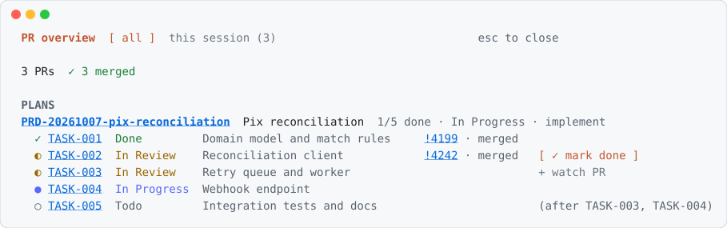

# spec-driven-dev

An [Agent Skill](https://agentskills.io) that makes the agent define what and why before writing code, one phase at a time, and ask before moving on.

[Install](#install) · [Phases](#phases) · [Files it writes](#files-it-writes) · [Index script](#index-script) · [Evals](#evals)

## Install

```bash
npx skills add heidiks/agent-kit -s spec-driven-dev -a claude-code   # or codex, cursor, gemini-cli, ...
```

Then ask the agent to "spec out" or "plan" a feature, or "where did we stop on PRD-...".

## Phases

| # | Phase | What happens |
|---|---|---|
| 1 | Interview | One question at a time until the problem, scope, constraints and risks are clear |
| 2 | Spec | The PRD (`spec.md`), with every decision and its alternatives |
| 3 | Visual overview | Mermaid diagrams of the flow and what changes, inside the PRD |
| 4 | Tasks | One file per task, with acceptance criteria and a dependency graph |
| 5 | Implement | One task at a time, only after an explicit go |
| 6 | Done | Criteria verified, statuses closed, index regenerated |

Each phase ends with a checkpoint: continue, revise, skip the next phase, or stop. **Lite mode** skips the interview and the visual overview for small, precise requests.

Each task ships as a pull request on a `task/<PRD>/<TASK>` branch (small related tasks may share one), linked both ways: every task lists the PR in `prs`, and the PR description carries one `Task: <PRD>/<TASK>` line per task. Tasks stay `In Review` until the PR is merged. The contract is in [references/pull-requests.md](references/pull-requests.md); tools such as the `pr-watch` plugin can read it, none is required.

With the [pr-watch](../../plugins/pr-watch/README.md) Claude Code plugin, each PR shows its task in the band, the overview lists every active spec with its tasks and their PRs, and a merged, green PR offers to mark its tasks done:

<picture>
  <source media="(prefers-color-scheme: dark)" srcset="../../plugins/pr-watch/assets/plans-dark.svg">
  
</picture>

## Files it writes

```
docs/prd/<component>/PRD-YYYYMMDD-slug/spec.md
docs/prd/<component>/PRD-YYYYMMDD-slug/TASK-001-slug.md
docs/prd/<component>/README.md            # generated index
```

Flat repos drop the `<component>` level. Status and phase live in each file's frontmatter, so files never move.

## Index script

`scripts/prd_index.py` (Python 3, standard library only) rebuilds the indexes from the frontmatter:

```bash
python3 scripts/prd_index.py            # write indexes
python3 scripts/prd_index.py --check    # CI: fail on a stale index or an invalid status
python3 scripts/prd_index.py --status   # every PRD with its phase and task progress
```

## Evals

`evals/` holds behavior checks run with `claude plugin eval`: the interview asks one question at a time, lite mode stops at a checkpoint before any code, and resuming reports the right phase and next step without editing files. Each case builds its own small repo with a scaffold script.

```bash
claude plugin eval skills/spec-driven-dev --scaffold --allow-tools Write Edit Bash --max-cost-usd 5
```

They spend model tokens on every run, so they are run by hand, not in CI.
