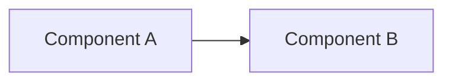
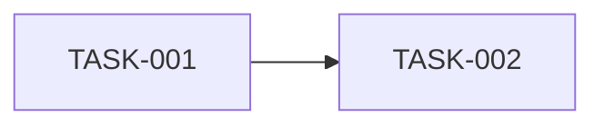

# PRD-YYYYMMDD-slug — Short Descriptive Title

## Context and Problem

> Why are we doing this? Who is affected, what happens today, why now.

## Interview notes

> Summary of the interview, per area, in the user's terms. "Skipped (lite mode)" in lite mode.

- **Problem:**
- **Outcome:**
- **Scope:**
- **Constraints:**
- **Approach:**
- **Risks:**
- **Dependencies:**

## Goals

> Checkable outcomes. "p99 below 500ms", not "improve performance".

- [ ] Goal 1

## Non-goals

> Tempting things that will explicitly not be done.

- Does not include X

---

## Functional Requirements

### FR-001 — Requirement name

Description in precise language ("the system shall", "the user can").

**Acceptance criteria:**
- When X happens, Y must happen

---

## Non-functional Requirements

| Attribute | Requirement |
|---|---|
| Performance | |
| Security | |
| Observability | |
| Compatibility | |

---

## Overview

> Mermaid diagram(s) of the flow and of what is new or changed. "Skipped" if the phase was skipped.

## Decisions

> Every non-trivial choice, from the interview or later, with the options considered.

| Decision | Alternatives considered | Rationale |
|---|---|---|
| | | |

---

## Dependencies

- Depends on: None
- Blocks: None

---

## Tasks

| Task | Title | Status | Pull request |
|---|---|---|---|
| [TASK-001](./TASK-001-slug.md) | Task title | Todo | - |

---

## Open Questions

- [ ] Question
