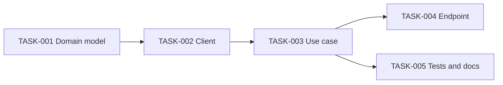

# Phase 4: Tasks

Break the spec into tasks, using [assets/task-template.md](../assets/task-template.md).

## Each task must be

- **Independent**: implementable without an unfinished task, except for dependencies
  declared in `depends_on`.
- **Small**: finished in one work session and reviewable as one pull request.
- **Verifiable**: objective acceptance criteria, traceable to the spec's requirements.
- **Focused**: one concept or layer; do not mix a schema change with business logic.

Adapt the split to the codebase's architecture (read two or three existing files first).
A typical split for an external integration:

```
TASK-001  Domain model and data structures
TASK-002  Client / repository layer
TASK-003  Business logic / use case
TASK-004  Interface / endpoint and input validation
TASK-005  Integration tests and documentation
```

## Steps

1. Create one `TASK-NNN-short-slug.md` per task, numbered from `TASK-001` within the PRD.
2. Fill `depends_on` for every task that needs another one first.
3. Add each task to the PRD frontmatter `tasks:` list and to its Tasks table.
4. Draw the task graph in the PRD (below). Check it has no cycles.
5. Regenerate the index (`scripts/prd_index.py`).
6. Run the checkpoint. The next phase is Implement, which always needs an explicit go.

## Task graph

````markdown

````

Tasks with no arrow between them can be done in parallel; say so in the summary.
