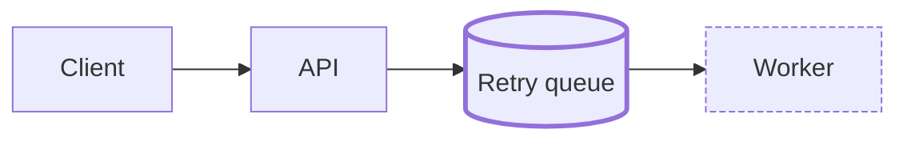

# Phase 3: Visual overview

Give the reader the shape of the plan in one glance, inside `spec.md`, so it is
versioned and reviewed with the rest of the PRD.

## Format: Mermaid

Use Mermaid code blocks. GitHub and Azure DevOps render them, they diff well in PRs, and
they need no extra tool. If the agent can also produce a richer visual (an HTML page, an
artifact), offer it as an extra, but the Mermaid diagram is what goes in the repo.

## What to draw

Draw only what helps; one or two diagrams is usually right.

| Situation | Diagram |
|---|---|
| Request or event flow across components | `sequenceDiagram` |
| Components touched and how they connect | `flowchart LR` |
| Lifecycle of an entity (order, job, document) | `stateDiagram-v2` |
| Data model changes | `erDiagram` |

Mark what is new or changed so the reader sees the delta, for example with a class:

````markdown

````

## Rules

- Keep each diagram under about 15 nodes; split it if it grows.
- Use the names that exist in the codebase (service, package, table), not invented ones.
- The diagram must agree with the Requirements and Decisions; if drawing it exposes a
  gap, add it to Open questions.

The task graph is drawn in phase 4, not here.

Then run the checkpoint from SKILL.md.
